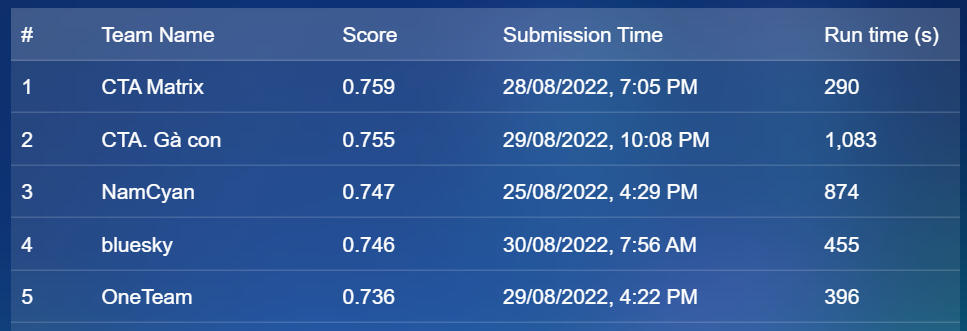
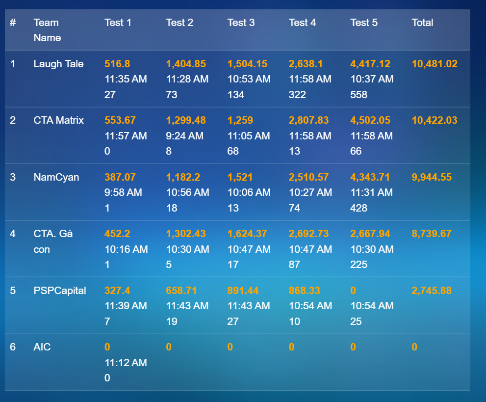

# Quy Nhon AI Hackathon 2022

## Table of content
- [Competition description](#competition-description)
- [Competition contact](#competition-contact)
- [Competition ranking](#competition-ranking)
  - [Review Analytics](#review-analytics)
  - [Trip planner](#trip-planner)
- [Contact](#contact)

## Competition description
The largest AI competition for engineers organized by Quy Nhon AI Center, FPT Software in collaboration with the Ministry of Science and Technology and VNExpress

## Competition contact
Fanpage: [Quy Nhơn AI Community](https://www.facebook.com/QNAICommunity)
Website: quynhon.ai

## Competition ranking
My team - NamCyan achieves 3rd place in both Review Analytics and Trip planner (final round)

### Review Analytics

  

### Trip planner

  

## Contact
If you have any questions, comments or suggestions, please do not hesitate to contact me via nam.lh173264@gmail.com
